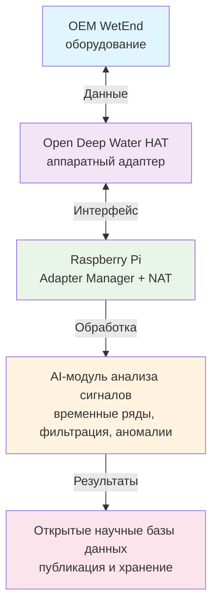
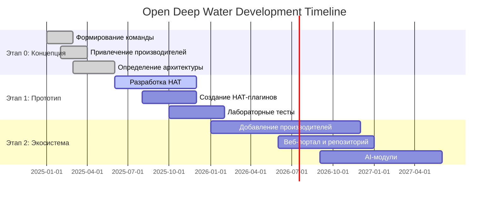
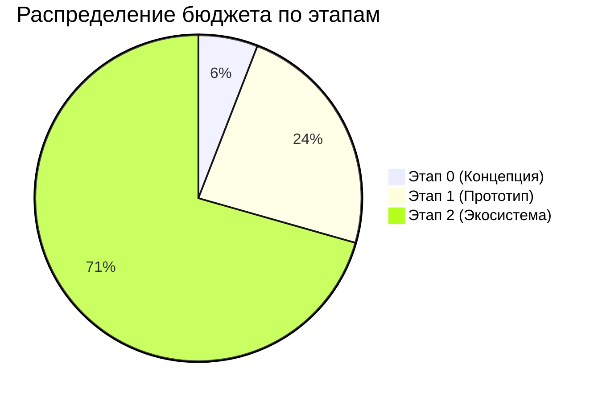

# Open Deep Water — OEM WetEnd Integration Program
## Концепция открытой научной платформы на Raspberry Pi с поддержкой OEM-WetEnd

---

## 1. Введение

**Open Deep Water** — это концепция будущей открытой платформы для сбора, анализа и публикации океанографических, климатических и экологических данных.

Платформа базируется на **Raspberry Pi** с аппаратным модулем **HAT** (Hardware Attached on Top) и программными адаптерами **НАТ** (Native Adapter Translator) для поддержки OEM-WetEnd любых производителей.

---

## 2. Предложение для производителей

- На основе вашей спецификации мы проектируем индивидуальный **Raspberry Pi HAT** для подключения вашего OEM-WetEnd
- Разрабатываем программный **НАТ** — драйвер, который преобразует ваш протокол в единый открытый формат
- Интеграция в открытую научную экосистему, где ваши устройства могут использоваться университетами, научными центрами и гражданскими научными проектами

---

## 3. Что получает производитель

✅ **Прототип HAT-адаптера** для интеграции с вашим OEM-WetEnd

✅ **Возможность последующей продажи** HAT-адаптеров по лицензии

✅ **Программный интерфейс** для Raspberry Pi

✅ **Совместимость с AI-модулем** для анализа сигналов (анализ временных рядов, фильтрация, детекция аномалий)

✅ **Упоминание бренда** в публикациях и демонстрационных проектах

---

## 4. Что требуется от производителя

### Техническая спецификация OEM-WetEnd:

- **Электропитание** (напряжение, ток)
- **Протокол** для работы с WetEnd
- **(Опционально)** предоставление тестового образца

---

## 5. Архитектура концепции

### Диаграмма потока данных

```mermaid
flowchart LR
    subgraph Hardware ["🔧 Аппаратный уровень"]
        OEM[OEM WetEnd Sensor]
        HAT[Custom HAT Adapter]
        RPI[Raspberry Pi 4/5]
    end
    
    subgraph Software ["💻 Программный уровень"]
        NAT[NAT Driver]
        MGR[Adapter Manager]
        API[REST API]
    end
    
    subgraph Analytics ["🤖 Аналитический уровень"]
        AI[AI Signal Analysis]
        ML[Machine Learning]
        FILTER[Data Filtering]
    end
    
    subgraph Storage ["🌐 Уровень хранения"]
        DB[(Local Database)]
        CLOUD[(Cloud Storage)]
        REPO[Open Science Repository]
    end
    
    OEM -->|Raw Data| HAT
    HAT -->|Digital Signal| RPI
    RPI --> NAT
    NAT --> MGR
    MGR --> API
    API --> AI
    AI --> ML
    ML --> FILTER
    FILTER --> DB
    DB --> CLOUD
    CLOUD --> REPO
```

---

## 6. Преимущества участия

| Преимущество | Описание |
|--------------|----------|
| 🔧 **Минимальные изменения** | В текущем оборудовании |
| 🌍 **Международная аудитория** | Выход на глобальный рынок |
| 🔌 **Стандартизация** | Совместимость с Raspberry Pi HAT |
| 🔬 **Научное позиционирование** | Бренд в сфере открытой науки |

---

## 7. Предварительный стратегический Roadmap

### Детальный план по этапам:

#### **Этап 0: Концепция и партнёрства** *(0–6 месяцев)*
- Формирование инициативной группы
- Привлечение первых производителей для пилотной интеграции
- Определение архитектуры HAT и формата данных

#### **Этап 1: Пилотный прототип** *(6–12 месяцев)*
- Разработка и тестирование первого универсального HAT
- Создание 1–2 НАТ-плагинов для OEM-WetEnd
- Демонстрация работы прототипа в лабораторных условиях

#### **Этап 2: Расширение экосистемы** *(12–24 месяца)*
- Добавление новых производителей и сенсоров
- Запуск веб-портала и открытого репозитория данных
- Внедрение AI-модулей для анализа сигналов

---

## 8. Лицензирование

| Компонент | Лицензия |
|-----------|----------|
| **Код** | Apache 2.0 / GPLv3 |
| **Аппарат** | CERN Open Hardware License v2 |
| **Данные** | Creative Commons CC-BY 4.0 |

---

## 9. Источники финансирования

### 9.1 Краудфандинг и сообщество
- **Kickstarter/Indiegogo** кампания для разработки первых HAT-прототипов ($50,000-100,000)
- **GitHub Sponsors** для поддержки разработки открытого ПО
- **Open Collective** для прозрачного управления средствами сообщества
- **Пожертвования** от научных институтов и экологических организаций

### 9.2 Научные гранты
- **NSF** (National Science Foundation) — программы Ocean Technology and Interdisciplinary Research
- **EU Horizon Europe** — кластер "Climate, Energy and Mobility"
- **Гранты РФФИ/РНФ** для российских участников проекта
- **Региональные экологические фонды** и программы

### 9.3 Корпоративное финансирование
- **Партнерские соглашения** с производителями OEM-WetEnd
- **Лицензионные отчисления** от продаж HAT-адаптеров
- **Спонсорство** от технологических компаний (Raspberry Pi Foundation, Intel, ARM)
- **Инвестиции венчурных фондов**, специализирующихся на CleanTech

### 9.4 Предварительный бюджет по этапам

| Этап | Бюджет | Основные расходы |
|------|--------|------------------|
| **Этап 0** (Концепция) | $25,000-50,000 | MVP, техническая документация, первые контакты |
| **Этап 1** (Прототип) | $100,000-200,000 | Разработка HAT, программирование НАТ, лабораторные тесты |
| **Этап 2** (Экосистема) | $300,000-500,000 | Масштабирование, веб-платформа, AI-модули, маркетинг |

---

## 📞 Контакты

� **Контактное лицо:** Andrew Buckin  
�📧 **Email:** ipm.grp@googlemail.com  
🌐 **Website:** (в разработке)  
📱 **GitHub:** (планируется)  

> *Проект находится на стадии концепции, организация в процессе формирования*

---

*© 2025 Andrew Buckin. Все права защищены.  
Документ распространяется под лицензией Creative Commons CC-BY 4.0*
